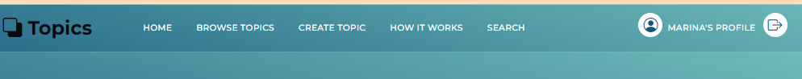
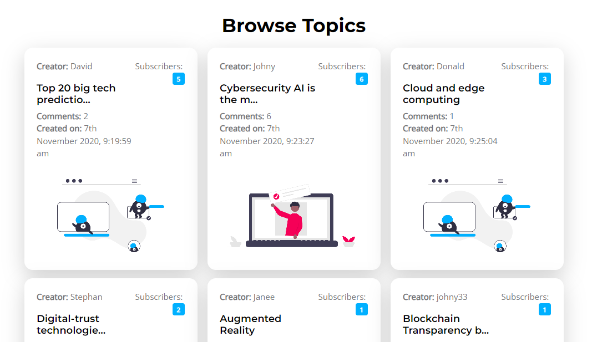
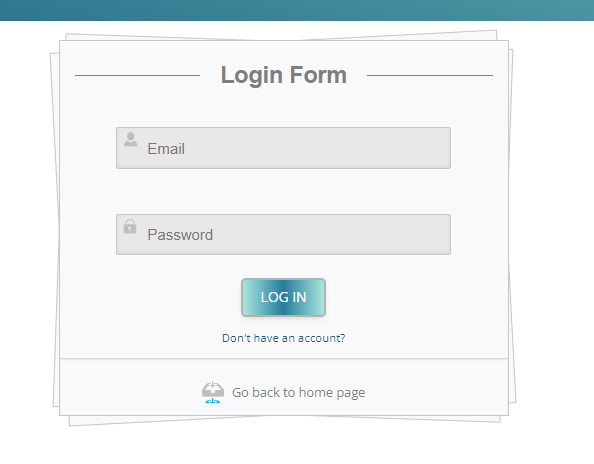
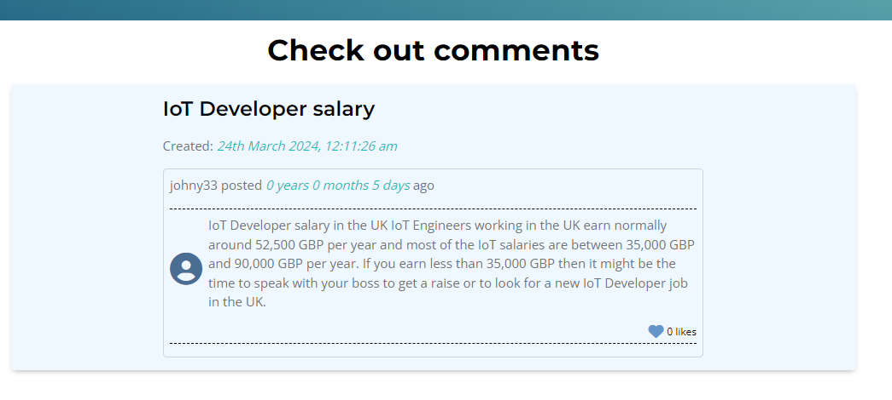

# Topics Forum
This is a WEB application using Angular for the frontend - discussion forum
for trending IT skills.
Used a Softuni Rest-api server for backend with a little modification (in
mongoose Models and Controllers) and MongoDB for storing data.
This application is a web-based platform designed to serve as a discussion
forum centered around trending IT topics. The frontend of the application
is developed using Angular, providing a dynamic and responsive user
interface. For the backend, it utilizes SoftUni’s REST API server, with
adjustments made to the mongoose models and controllers to suit the
application&#39;s needs.
## Steps for local installation and review:
1. Clone the repository: https://github.com/Djani-Antova/My_Angular_Project
2. Navigate to Rest-api folder:
- npm install - command to install all package dependencies;
- npm start - command to install all command to start backend server;
3. Navigate to topic-forum folder:
- npm install - command to install all package dependencies;
- ng serve – to run client Angular app
## Site overview
### Every page contains navigation
### NON logged-in user

### Logged-in user

### Every page contains footer

### Home page
Public page for all users. Home page retrieves html with latest 3 created themes.
There is a button with an option navigating to All Topics page.

### Browse All page
Public page for all users. All themes are rendered.

### Login page

The login form expects as input: email and password.
There is a validation of email:
Email address must have at least 9 symbols. The valid domain name - &quot;bg&quot; or &quot;com&quot;.
Password should be at least 5 symbols as well

### Register page

The register form expects as input: username, email, password and confirm
password.
Valid inputs in this case are:
Username should be at least 5 symbols.
Email address must have at least 9 symbols. The valid domain name -
&quot;bg&quot; or &quot;com&quot;.
- Password should be at least 5 symbols as well
- Repeat password and password must matched.

### DEMO USERS
- carina@gmail.com pass: 123123;
- peter@gmail.com pass: 123123;
- marina@gmail.com pass: 123123;

### Add new topic
Page only for logged in users.
Every logged in user can create a new theme in forum.
The new theme form expects as input: theme name, post text.
Valid data in this case is:
- Theme name - should be at least 5 characters
- Post text - should be at least 10 characters long
The &quot;Post Theme&quot; button should be disabled if the inputs are NOT valid.

### Profile page
Page only for logged in users
Profile page contains:
- personal account information for user;

### Search page
Public page for all users.
Search theme - case insensitive

### Theme deatails page
The page shows in two options - public and private(for logged in users).
1. Public part:
- all users can see post text, date of create, poster user and numbers of
likes, but not to like, edit, delete post or to add a new comment.

2. Private part - only for logged in users:
- Logged-in user can post a new comment;
- Logged-in user can like every comment. If it is already liked, there are a message &quot;Already liked&quot;;
- If the user is owner of the post, he can edit and delete the post, icons for edit and delete are rendered.

#### Theme deatails - delete post
If owner wants to delete ahis post, he got a warning

#### Theme deatails - edit post

#### Applied error handling to avoid crashes 

#### Applied Validation to avoid crashes 

## Used additional libraries
- moment js
- bootstrap
